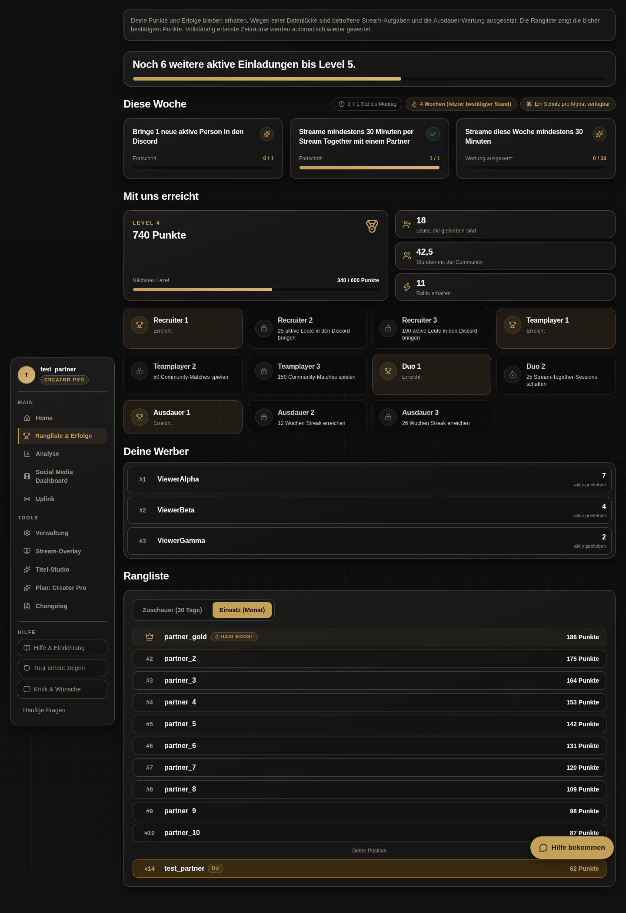
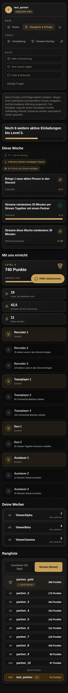

# Disposition und gebundener Nachweis

## Gegenstand und Grenzen

Der reguläre Gesamt-Gate-Aufruf bleibt an den produktiven Ausgangsstand f4034597517f2921ad250738b964dd4c712f9448 und den Branch fix/challenges-not-current-20261001 gebunden. Originalstate: /home/nathanael/Documents/.claude/gpt-workers/review-state/9e7e28da0167f06f.json, Statekey 9e7e28da0167f06f. Es gibt keine gesonderte Review-UUID. Vor dieser Disposition steht das lokale Urteil auf BLOCK, Runde 2, nicht eskaliert. Kein State wurde bearbeitet, zurückgesetzt oder durch ein externes Urteil ersetzt.

Der frühere Queue-/Lease-Vorschlag wurde vom koordinierenden Root ausdrücklich zurückgezogen. Verbindlich gilt der synchrone lokale Reviewpfad: dokumentierter Dispositionscommit, unabhängig freigegebener Rust-Transport mit authentifizierten Hostregeln, dann derselbe Gesamtaufruf. Ein technischer Fehler oder das Eigengate gegen origin/main ist keine Gesamtfreigabe.

```sh
python3 /home/nathanael/Documents/.claude/gpt-workers/gate_hook.py --review --repo /home/nathanael/.worktrees/tb-challenges-not-current --base f4034597517f2921ad250738b964dd4c712f9448 --head fix/challenges-not-current-20261001
```

Keine Modell-, Effort-, Override- oder alternative Basisflags. gate-release.log: Exit 1 auf 4a78d354241aecc3ad735f85c34a643527a0f7d9. gate-release-final.log: Exit 2 auf b4b1088ceb0161b1ad92b3673de1eea219793875, kein Urteil wegen Transport-/Ressourcenfehlern. gate-release-retry.log: Exit 1 auf b4, beide ursprünglichen Befunde STILL.

## Originalbefunde und Spec-Disposition

1. `.github/workflows/rust-sqlx-check.yml:0 (required)`: „PR verification is deleted.“ Der Befund nennt außerdem brain-adapter-offline.yml, frontend-pr-gate.yml, lint-and-typecheck.yml, manifest-scope.yml, roadmap-history.yml und zugehörige CI-Skripte und Tests. Er verlangt Restaurierung oder Ersatz der entfernten Prüfungen.
2. `.github/workflows/codeql.yml:0 (analyze)`: „Scheduled security verification is deleted.“ Genannte Zwillinge: rust-security.yml, secret-scanning.yml und security-deep-scan.yml. Betroffen sind die entfernten SAST-, RustSec-, Abhängigkeits- und Geheimnisscan-Jobs.

Die Entfernung stammt aus dem bereits auf origin/main befindlichen Nutzercommit 2aba62afd899c66f5496f09cbb141ed4f50b928f, EarlySalty, „chore: GitHub Actions abschaffen“. Dieser Fix entfernt keine weiteren Actions. Die verbindliche Hostregel /home/nathanael/AGENTS.md, Abschnitt Abschluss, lautet: „GitHub Actions sind kein Gate und halten keinen Merge auf. Schutz-Hooks nicht umgehen.“ Zeile 12 verlangt beim Spec-Konflikt, den berechtigten Kern umzusetzen und die Abweichung begründet zu berichten. SHA256 dieser gelesenen Hostregel: 4d23d12869ec62250f6516b97d99ac2823b1367d5353e05dc9cc26f79d707c8e.

Disposition: Die Actions werden gemäß Nutzerentscheidung nicht restauriert. Der berechtigte Prüfbedarf wird durch die unten belegten lokalen Compiler-, Format-, Clippy-, Regression-, Datenbank- und Sichtprüfungen sowie das weiterhin verpflichtende unabhängige lokale Bug-/Security-Gate bearbeitet. Diese Läufe werden nicht als neuer automatischer Sicherheitsdienst oder als Ersatz sämtlicher historischer Scan-Jobs ausgegeben. Die Spec-Abweichung zum Restaurierungsverlangen bleibt ausdrücklich benannt. Nur ein neues echtes lokales ALLOW schließt den bestehenden BLOCK.

## Beide ursprünglichen NITs

* `rust/crates/fireworks-model-selection/src/lib.rs:206`, Zwilling `rust/crates/tb-llm/src/daily_model_resolver.rs`, probe_failure_preserves_last_known_working_state: Testfixtures setzen den vertrauenswürdigen UID 1000 voraus. Der aktuelle Prüfnutzer ist UID 1000. Die beiden Dateien sind gegenüber origin/main unverändert; die Portabilität zu einem anderen unprivilegierten Prüfnutzer ist nicht belegt und wird nicht als behoben bezeichnet. Die produktive Vertrauensgrenze wird in diesem Challenges-Fix nicht erweitert.
* `bot/dashboard_v2/src/pages/Challenges.tsx:308`: Banner, ausgesetzte Aufgabe und bestätigte Serie benötigen sichtbare Desktop-/Mobilbelege. Die bestehenden lokal geprüften PNGs liegen jetzt als prüfbare Dateien in dieser Akte, nicht nur als absolute Pfadangaben. Der Browserregressionstest verwendet synthetische Fixtures; diese Bilder belegen das Layout, keinen authentifizierten Liveabruf.





Bildhashes: Desktop 472fee87c1664340380689cb389c5d8797896acce8ace52e7d1b7bca34531a09; Mobil 8ec2d5229c6b1ed778ae6c2fb4bbced11e0a741e1ef84f0552d02debffba8155.

Die zusätzlichen NITs des Eigengates auf b4 bleiben ebenfalls sichtbar: Historische Watchdog-Lücken werden erst oberhalb von drei Pollintervallen gemeldet, Kategorie-Abdeckung verwirft bereits Lücken oberhalb von zwei. Eine kurze Lücke zwischen diesen Schwellen kann deshalb einen Teilzustand ohne historischen Alarm auslösen; diese Toleranzdifferenz ist nicht als behoben ausgegeben. Der Wiederherstellungs-PG-Test repariert synthetische Collector-Laufmetadaten, nicht historische Twitch-Rohdaten. Der Collector besitzt keinen belegten rückwirkenden Backfillpfad; in der Produktion heilt eine historische Abdeckungslücke durch das Herausfallen aus dem Wertungsfenster. Der Test ist kein Beweis einer nachträglichen Wiederherstellung bereits übergangener Rohsamples. Das Eigengate gab mit diesen NITs ALLOW, die unabhängige Gesamtprüfung bleibt erforderlich.

## Codeinputs und Toolchain

Sourcebasis origin/main: 14bc1f479e32394fe2977f8c8ef85e6c5bff66e1. Funktionaler Freeze: 4a78d354241aecc3ad735f85c34a643527a0f7d9. b4b1088ceb0161b1ad92b3673de1eea219793875 ändert ausschließlich REVIEW.md; Baum bcb69df04b38056b9eb4ff5690a7696099ce2cf6. Der Vergleich von 4a und b4 außerhalb .tasks lieferte Exit 0. CODEINPUTS.sha256 bindet die geänderten ausführbaren Quellen und Betriebs-/Dokumentdateien dieses Standes. Dieser Dispositionscommit ändert ausschließlich die Reviewakte.

Compiler /home/nathanael/.cargo/bin/cargo +1.97.1, rustc 1.97.1 (8bab26f4f68e0e26f0bb7960be334d5b520ea452), Host/Standardtarget x86_64-unknown-linux-gnu, LLVM 22.1.6. Kein explizites --target oder Featureoverride in den unten genannten Aufrufen. Die Rust-Tests verwenden ausschließlich den vorhandenen Docker-Testcontainer, PostgreSQL 16.6, über die ignorierte rust/test-database.json; keine Produktionsdaten oder Zugänge werden in der Akte abgelegt.

Frühere Test-/Clippylogs entstanden im WIP, das anschließend als funktionaler Freeze 4a committed wurde. Sie enthalten keine ursprüngliche Git-SHA-Attestation. Ihre Bindung ist die unveränderte funktionale Quelle, nicht eine nachträglich behauptete Ausführung auf dem späteren Dispositionscommit. Die nach Buildende erneut ausgeführten Format-, Shell- und neun Frontendtests sind direkt an den sauberen b4-Stand gebunden.

## Exakte lokale Checks und Ergebnisse

Alle Cargo-Aufrufe verwenden das oben angegebene Programm und +1.97.1. Pfade der Logs beziehen sich auf dieses Taskverzeichnis.

```sh
cargo +1.97.1 clippy --manifest-path rust/Cargo.toml --no-deps -p tb-effort -p tb-raid -p tb-dashboard-api -p tb-category-collector --all-targets -j2
cargo +1.97.1 test --manifest-path rust/Cargo.toml -p tb-effort -p tb-raid -p tb-category-collector -j2 -- --test-threads=2
cargo +1.97.1 test --manifest-path rust/Cargo.toml -p tb-effort -p tb-raid -p tb-category-collector -j2 incidents_survive_retries_and_recovery_opens_a_new_incident -- --test-threads=2
cargo +1.97.1 test --manifest-path rust/Cargo.toml -p tb-dashboard-api --lib handlers::challenges::tests -j2 -- --test-threads=1
cargo +1.97.1 test --manifest-path rust/Cargo.toml -p tb-dashboard-api --lib handlers::leaderboard::tests -j2 -- --test-threads=1
```

Reguläres Clippy: Exit 0 mit vorhandenen Warnungen, clippy-final.log. Drei-Paket-Tests: Exit 0, affected-tests-final.log; Collector 8, Watchdog 2, Effort-Unit 19, Effort-Postgres 16, Source-Readiness 1, Raid-Unit 377 sowie vorhandene Integrationssuites erfolgreich. Separater finaler Watchdog-PG-Test: Exit 0, watchdog-gate-tests-final.log; echte SQL-Pfade für neue Vorfälle bei unveränderter Telemetrie und erst nachträglich erfasste benachbarte Lücken. Challenges: Exit 0, 2 Tests, api-challenges-tests.log. Leaderboard: Exit 0, 7 Tests, api-leaderboard-tests.log. Der bestehende strikte Monatsboost wird mit fehlender Kategoriequelle weiterhin abgewiesen.

```sh
rustfmt +1.97.1 --edition 2021 --config skip_children=true --check rust/bin/tb-category-collector/src/bin/tb-twitch-watchdog.rs rust/crates/tb-dashboard-api/src/handlers/challenges.rs rust/crates/tb-dashboard-api/src/handlers/leaderboard.rs rust/crates/tb-effort/src/evidence.rs rust/crates/tb-effort/src/lib.rs rust/crates/tb-effort/src/projection.rs rust/crates/tb-effort/src/quests.rs rust/crates/tb-effort/src/types.rs rust/crates/tb-effort/tests/postgres.rs rust/crates/tb-raid/tests/monthly_raid_boost.rs
cargo +1.97.1 fmt --manifest-path rust/Cargo.toml -p tb-effort -p tb-raid -p tb-dashboard-api -p tb-category-collector -- --check
bash -n ops/systemd/deploy-twitch-release ops/systemd/install-twitch-release.sh
```

Geänderte Rust-Dateien: Exit 0, fmt-changed-bound.log. Gesamte vier Pakete: Exit 1, fmt-packages-bound.log. Der neue gebundene Lauf zeigt vorhandene Formatabweichungen in 33 unveränderten Dashboard- und sieben unveränderten Raid-Dateien. Shellsyntax: Exit 0, shell-bound.log. Kein pauschales „vier Pakete strict grün“.

Strict-Clippy mit -D warnings war wegen bestehender Lints in tb-chat und unveränderten Dashboard-Dateien nicht erfolgreich. Die zusätzlich ausgeführte vollständige Dashboard-Lib-Suite ist ebenfalls nicht grün: tests.log meldet 1303 bestanden, 8 fehlgeschlagen, 3 ignoriert. Die Fehler betreffen auth::level::tests::master_session_ist_nur_mit_admin_kontext_oder_mode_cookie_admin, drei handlers::affiliate::tests::claim_api_*-Tests, handlers::engagement_settings::tests::admin_toggle_schaltet_versand_und_lesepfad_atomar_profil_bleibt_erhalten, zwei handlers::social_media::tests (abbruch_fremder_clip_ist_403_und_unbekannter_clip_404 sowie approval_und_zeitplan) und handlers::streamers::tests::twitch_admin_login_gets_200. Der Vergleich sämtlicher betroffener Auth-/Handlerquellen gegen origin/main lieferte Exit 0. Diese Baselinefehler bleiben offen benannt; die erfolgreichen isolierten Challenges-/Leaderboardtests ändern dieses Gesamtergebnis nicht.

```sh
# Arbeitsverzeichnis bot/dashboard_v2
npm run build
node --import tsx --test tests/challenges.test.ts
CHALLENGES_ARTIFACTS=/home/nathanael/.claude/sichtpruefung/challenges-not-current node --test tests/challenges.browser.test.mjs
# Arbeitsverzeichnis bot/admin_dashboard beziehungsweise website
npm run build
```

Dashboard-, Admin- und Websitebuild: Exit 0, frontend-build.log bzw. admin-build.log, Websiteergebnis im bisherigen Sitzungsnachweis. Bestehende Challenges-Tests erneut auf b4: Exit 0, 9/9, frontend-tests-bound.log. Browserregression Desktop/Mobil: Exit 0 im bisherigen Sitzungsnachweis, kein ursprünglicher persistierter Konsolenlog; inspectierbare Bilder und Testquelle liegen vor. Keine Behauptung eines vollständigen Frontend-Gesamttestlaufs.

## Releasebindung und noch fehlender Abschluss

```sh
cargo +1.97.1 build --manifest-path rust/Cargo.toml --release -p tb-bot -p tb-dashboard -p tb-stream-audit-bin -p tb-category-collector --bin tb-bot --bin tb-dashboard --bin clip_context_learn --bin tb-stream-audit --bin tb-category-collector --bin tb-twitch-watchdog -j2
```

Exit 0 nach 13m53s, release-build-b4.log. Alle sechs ELF-Sektionen .twitch_build sind exakt b4b1088ceb0161b1ad92b3673de1eea219793875 ohne dirty. Keine laufenden eigenen Cargo-Releasebuilds. Der vorherige auf 4a gestartete erste Release-Lauf endete ebenfalls mit Exit 0 nach 26m14s, ist wegen des zwischenzeitlichen Dokumentcommits aber nicht die finale Artefaktbindung.

Die Binaries bleiben als b4-Build nachgewiesen. Ein späterer Dispositions-HEAD wird nicht in die Binaries hineingeschrieben oder als bereits gebaut ausgegeben; der reguläre Installer verlangt für den tatsächlich gewählten Releasecommit denselben sauberen Herkunftsmarker. Daraus folgende Neubauten werden separat gebunden.

Current ist weiterhin f403. bot.toml bleibt SHA256 301b802b668b2c12d4ca9895677b46db1d9626a620dd2c77dc961946f9d4b7e0. Brain/Serve und normale /etc-Konfiguration sind unverändert. Keine produktive Migration, Unitinstallation, Dienstunterbrechung oder Currentmutation wurde ausgeführt. TokenDB umfasst 73 Resume-Werte, sämtlich done, keine aktive Wiederaufnahme; keine Werte wurden ausgegeben. Der vorhandene Rust-Wartungsmodus ist nach Stopp des Alt-Writers und vor neuem Botstart vorgesehen, danach Constraintvalidierung.

Der unterstützte Browserruntimezugang liefert keine verbundene Sitzung. Der Nutzer ist für die beiden echten authentifizierten GETs /twitch/api/v2/challenges/me und /twitch/api/v2/challenges/viewers nach der tatsächlichen Deploy-Meldung angefragt: nur HTTP-Statuscodes und category_data_complete aus /me. Kein Cookie-, Token- oder Sessionstorezugriff. Livebeweis, reguläres Gesamt-ALLOW, Merge/Push, koordiniertes Deployment und Cleanup bleiben offene Abschlussarbeit.

Die Loghashes stehen in LOGS.sha256. Sie binden vorhandene Prüfergebnisse und ersetzen kein unabhängiges Urteil.
